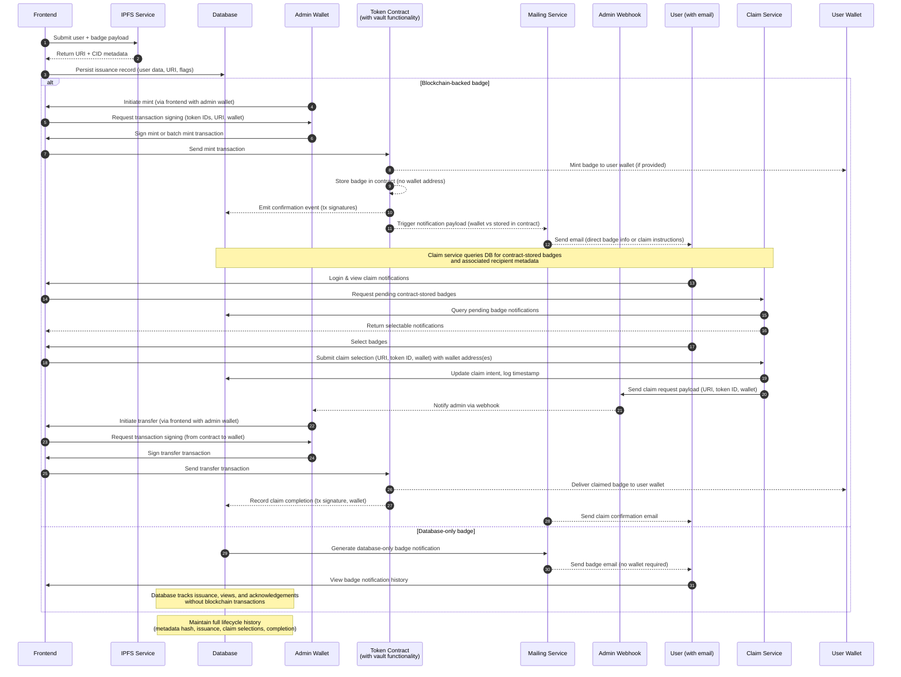
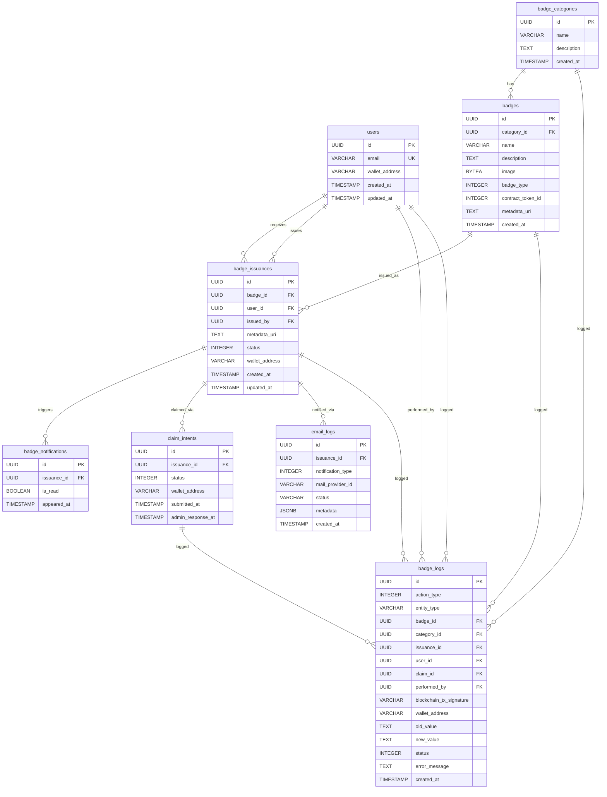

# Boost Badging System – Streamlined Workflow Plan

## Overview

Refined Solana-based badging flow that supports two badge classes:

- **Blockchain-backed badges** – minted to wallets or stored inside the token contract until claimed.
- **Database-only badges** – managed purely inside the application database with no blockchain touchpoints or wallet requirement.

Both classes share the same metadata and notification pipeline. The implementation window is estimated at three weeks.

---

## Workflow Diagram

---

## End-to-End Workflow

### Admin Story

1. **Preparation**  
   - Admin retrieves token catalogue and recipient roster via frontend.  
   - Admin selects badge set (single or batch) and recipients.

2. **Metadata & Persistence**  
   - Admin submits badge issuance payload to the IPFS service via frontend. 
   - IPFS returns content URI plus derived metadata (hash, gateway URL).  
   - Application persists issuance record in the database, including user data, claim eligibility flags, and URI references.

3. **Minting / Issuance**  
   - **Blockchain-backed badges**  
     - Admin initiates mint via frontend with admin wallet. Frontend requests transaction signing from admin.  
     - Admin signs mint or batch mint transaction (supplying recipient wallet if available, token IDs, and metadata URI).  
     - Frontend sends the signed transaction to the token contract.  
     - Token contract (with built-in vault functionality) validates call and mints tokens:
       - If wallet provided: Routes tokens directly to user wallets.
       - If no wallet provided: Stores tokens in the contract's internal storage (vault functionality).
     - Token contract emits confirmation event with transaction signatures to the database.
     - Post-confirmation hook triggers notification payload to mailing service (indicating whether badge was sent to wallet or stored in contract).
     - Mailing service sends email to user:
       - Direct wallet recipients – badge details and blockchain links.
       - Contract-stored recipients – claim instructions, emphasizing security posture.
   - **Database-only badges**  
     - Application marks the issuance as "database-only" and stores the badge entirely in the database (no wallet required).  
     - Database generates database-only badge notification and triggers mailing service.
     - Mailing service sends badge email to user.

4. **Claim Processing (Blockchain-backed / Contract-Stored Only)**  
   - Admin receives webhook notification when user submits a claim request.
   - Admin initiates transfer via frontend with admin wallet. Frontend requests transaction signing (from contract to wallet).
   - Admin signs transfer transaction.
   - Frontend sends the signed transfer transaction to the token contract.
   - Token contract delivers the claimed badge to the user wallet.
   - System records claim completion in the database (transaction signature, wallet, timestamp).
   - Mailing service sends claim confirmation email to the user.

5. **Auditing & Reporting**  
   - Admin accesses dashboard to view mint/claim status, IPFS hashes, and notification delivery logs.
   - Database maintains full lifecycle history (metadata hash, issuance, claim selections, completion).

---

### User Story

1. **Receiving Badge Notifications**  
   - User receives email notification about badge issuance:
     - **Blockchain-backed badges (direct wallet)**: Email contains badge details and blockchain links.
     - **Blockchain-backed badges (contract-stored)**: Email contains claim instructions, emphasizing security posture.
     - **Database-only badges**: Email contains badge details.

2. **Viewing Badge Notifications (Database-only Badges)**  
   - User logs into the frontend.
   - User views badge notification history.
   - User can view database-only badges without wallet submission or admin transfer.

3. **Claiming Badges (Blockchain-backed / Contract-Stored Only)**  
   - User logs into the frontend and views pending claim notifications.
   - Frontend requests pending contract-stored badges from the claim service.
   - Claim service queries the database for pending badge notifications and returns selectable notifications to the frontend.
   - User selects one or more badges and provides wallet address(es) (one wallet can be used for multiple badges, or separate wallets for each badge), then submits the claim request.
   - Frontend sends the claim selection (URI, token ID, wallet) to the claim service.
   - Claim service updates the database with claim intent details (URI, token ID, wallet, timestamp).
   - Claim service sends claim request payload (URI, token ID, wallet) to admin webhook.
   - User waits for admin to process the claim request.
   - User receives claim confirmation email once the badge is transferred to their wallet.
   - **Note**: Database-only badges skip this section entirely – users already "own" the badge in the portal and can view without wallet submission or admin transfer.

---

## Database Schema

**Note on `wallet_address` in `users` table**: The `wallet_address` field in the `users` table is used to support batch minting operations by admins. When an admin executes a batch-mint action, it would be impossible to manually input all wallet addresses for each recipient. Therefore, users who have a wallet address should set it in their profile page. If a user has not set their wallet address, their badge tokens are automatically minted to the token contract (vault functionality) instead of directly to their wallet, requiring them to claim the badge later.

---

## Appendix

The following appendix provides illustrative sample data for every column in the database schema. These examples demonstrate the expected data types, formats, and values for each table in the system, serving as a reference for implementation and testing.

---

## Appendix A: Database Schema Sample Data

Illustrative values for every column in the schema.

### `users`
| Column | Sample |
| --- | --- |
| `id` | `8f7c7d9b-1c0d-49f1-a29c-03d0c4c2c111` |
| `email` | `alice@example.com` |
| `wallet_address` | `0x32ffw32....3f2` |
| `created_at` | `2025-02-01T10:12:55Z` |
| `updated_at` | `2025-02-10T08:00:00Z` |

### `badge_categories`
| Column | Sample |
| --- | --- |
| `id` | `2fcb0271-6316-4c45-9375-8fca4c98840c` |
| `name` | `Contribution Badges` |
| `description` | `GitHub activity milestones` |
| `created_at` | `2025-02-01T09:00:00Z` |

### `badges`
| Column | Sample |
| --- | --- |
| `id` | `0b1222b9-fd3f-4c4c-8e20-04a0670a74c2` |
| `category_id` | `2fcb0271-6316-4c45-9375-8fca4c98840c` |
| `name` | `SolDev Mentor` |
| `description` | `Mentored five Solana-focused Boost contributors` |
| `image` | `image data (this field may be blob, so the image data can be saved in database.)` |
| `badge_type` | `1 (database-only:0, blockchain:1)` |
| `contract_token_id` | `0 (database-only:null, blockchain:token_id)` |
| `metadata_uri` | `ipfs://Qm...abc/23fwefsdcwcf.json` |
| `created_at` | `2025-02-03T12:05:10Z` |

### `badge_issuances`
| Column | Sample |
| --- | --- |
| `id` | `3bf34c2a-3bb0-47cb-9336-6a9c8f4ecb5a` |
| `badge_id` | `0b1222b9-fd3f-4c4c-8e20-04a0670a74c2` |
| `user_id` | `8f7c7d9b-1c0d-49f1-a29c-03d0c4c2c111` |
| `metadata_uri` | `ipfs://Qm...abc/sw323edwswef42.json (this value is for only this issuance and updated from IPFS after issuance)` |
| `status` | `0 (pending:0, issued:1, claimed:2) Note: For database-only badges, status 1 (issued) is not used. Status transitions directly from 0 (pending) to 2 (claimed), as 'issued' and 'claimed' are equivalent for database-only badges.` |
| `wallet_address` | `0x32ffw32....3f2` |
| `issued_by` | `4783355a-4095-4fe8-a601-7d61d272af24` |
| `created_at` | `2025-02-05T16:20:00Z` |
| `updated_at` | `2025-02-05T16:20:00Z` |

### `badge_notifications`
| Column | Sample |
| --- | --- |
| `id` | `a8bcb904-6de7-4c49-96f9-9b0c165f08f1` |
| `issuance_id` | `3bf34c2a-3bb0-47cb-9336-6a9c8f4ecb5a` |
| `is_read` | `false` |
| `appeared_at` | `2025-02-05T16:25:00Z` |

### `claim_intents`
| Column | Sample |
| --- | --- |
| `id` | `6d42dc09-1a7f-4cd5-8f24-71e2fc7df7c8` |
| `issuance_id` | `3bf34c2a-3bb0-47cb-9336-6a9c8f4ecb5a` |
| `status` | `0 (pending:0, transferred:1)` |
| `wallet_address` | `0x32ffw32....3f2` |
| `submitted_at` | `2025-02-06T09:30:00Z` |
| `admin_response_at` | `null` |

### `badge_logs`
| Column | Sample |
| --- | --- |
| `id` | `3232ff1-f23f-32f23-23f2f-23f23f23f23` |
| `action_type` | `0 (badge_created:0, badge_category_created:1, badge_issued:2, badge_claimed:3, wallet_updated:4)` |
| `entity_type` | `issuance (badge, badge_category, issuance, user, claim_intent)` |
| `badge_id` | `0b1222b9-fd3f-4c4c-8e20-04a0670a74c2 (nullable, for badge-related operations)` |
| `category_id` | `2fcb0271-6316-4c45-9375-8fca4c98840c (nullable, for category-related operations)` |
| `issuance_id` | `3bf34c2a-3bb0-47cb-9336-6a9c8f4ecb5a (nullable, for issuance-related operations)` |
| `user_id` | `8f7c7d9b-1c0d-49f1-a29c-03d0c4c2c111 (nullable, for user-related operations)` |
| `claim_id` | `6d42dc09-1a7f-4cd5-8f24-71e2fc7df7c8 (nullable, for claim-related operations)` |
| `performed_by` | `4783355a-4095-4fe8-a601-7d61d272af24 (admin/user who performed the action)` |
| `blockchain_tx_signature` | `5HgZQ...sd8 (nullable, only for blockchain operations)` |
| `wallet_address` | `0xef23rg23f...f23f (nullable, for wallet-related operations)` |
| `old_value` | `null (or previous value for updates, e.g., old wallet address)` |
| `new_value` | `null (or new value for updates, e.g., new wallet address)` |
| `status` | `0 (success:0, failed:1, pending:2)` |
| `error_message` | `null (or error details if status is failed)` |
| `created_at` | `2025-02-05T16:21:00Z` |

### `email_logs`
| Column | Sample |
| --- | --- |
| `id` | `ddf95ffa-3236-4413-be0a-09964fa7150d` |
| `issuance_id` | `3bf34c2a-3bb0-47cb-9336-6a9c8f4ecb5a` |
| `notification_type` | `0 (issued_and_claimed:0 - badge sent to wallet for blockchain-based, or issued for database-only, only_issued:1 - badge stored in contract vault, awaiting claim for blockchain-based only)` |
| `mail_provider_id` | `mailman-msg-49811` |
| `status` | `sent` |
| `metadata` | `{"template":"contract-claim","attempt":1}` |
| `created_at` | `2025-02-05T16:26:00Z` |

---

