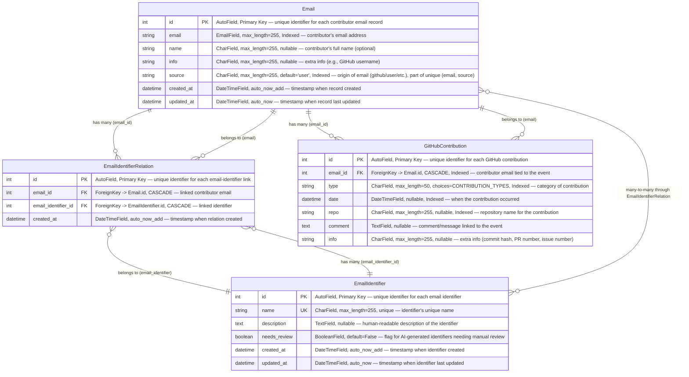

# Contribution Models - Field Relationship Diagram

## Remark

-   Email Model: (email, source) - ensures unique email per source (same email can exist with different sources, but each combination is unique)

-   EmailIdentifierRelation Model: (email, email_identifier) - ensures unique relationship between email and identifier pairs (each email can be connected to multiple identifiers, but the same email-identifier pair cannot be duplicated)
