# Contribution Models - Field Relationship Diagram

```mermaid
erDiagram
    Email {
        int id PK "AutoField, Primary Key — unique identifier for each contributor email record"
        string email UK "EmailField, max_length=255, Indexed — contributor's email address (unique)"
        datetime created_at "DateTimeField, auto_now_add — timestamp when record created"
        datetime updated_at "DateTimeField, auto_now — timestamp when record last updated"
    }

    Identity {
        int id PK "AutoField, Primary Key — unique identifier for each identity"
        string name "CharField, max_length=255, nullable — identity name"
        text description "TextField, nullable — human-readable description of the identity"
        m2m emails "ManyToManyField -> Email through EmailIdentityRelation — linked contributor emails"
        boolean needs_review "BooleanField, default=False — flag for AI-generated identities needing manual review"
        datetime created_at "DateTimeField, auto_now_add — timestamp when identity created"
        datetime updated_at "DateTimeField, auto_now — timestamp when identity last updated"
    }

    EmailIdentityRelation {
        int id PK "AutoField, Primary Key — unique identifier for each email-identity link"
        int email_id FK "ForeignKey -> Email.id, CASCADE — linked contributor email"
        int identity_id FK "ForeignKey -> Identity.id, nullable, CASCADE — linked identity"
        datetime created_at "DateTimeField, auto_now_add — timestamp when relation created"
    }

    User {
        int id PK "AutoField, Primary Key — unique identifier for each user record"
        int email_id FK "ForeignKey -> Email.id, CASCADE, Indexed — contributor email for this user profile"
        string name "CharField, max_length=255, nullable — contributor's full name"
        string info "CharField, max_length=255, nullable — extra info (e.g., GitHub username)"
        string source "CharField, max_length=255, choices=USER_SOURCES, Indexed — origin of data (github/wg21/etc.)"
        datetime created_at "DateTimeField, auto_now_add — timestamp when user record created"
        datetime updated_at "DateTimeField, auto_now — timestamp when user record last updated"
    }

    GitHubContribution {
        int id PK "AutoField, Primary Key — unique identifier for each GitHub contribution"
        int email_id FK "ForeignKey -> Email.id, CASCADE, Indexed — contributor email tied to the event"
        string type "CharField, max_length=50, choices=CONTRIBUTION_TYPES, nullable, Indexed — category of contribution"
        datetime date "DateTimeField, nullable, Indexed — when the contribution occurred"
        string repo "CharField, max_length=255, nullable, Indexed — repository name for the contribution"
        text comment "TextField, nullable — comment/message linked to the event (UI limits 30 characters)"
        string info "CharField, max_length=255, nullable — extra info (commit hash, PR number, issue number)"
    }

    Wg21Contribution {
        int id PK "AutoField, Primary Key — unique identifier for each WG21 paper contribution"
        int email_id FK "ForeignKey -> Email.id, CASCADE, Indexed — contributor email tied to the contribution"
        int year "IntegerField, nullable, Indexed — year of the contribution"
        string title "CharField, max_length=255, nullable — title of the paper where the contribution was made"
        string paper_id "CharField, max_length=255, nullable — paper ID where the contribution was made"
    }

    Email ||--o{ EmailIdentityRelation : "has many (email_id)"
    Identity ||--o{ EmailIdentityRelation : "has many (identity_id)"
    Email ||--o{ GitHubContribution : "has many (email_id)"
    Email ||--o{ Wg21Contribution : "has many (email_id)"
    Email ||--o{ User : "has many (email_id)"

    EmailIdentityRelation }o--|| Email : "belongs to (email)"
    EmailIdentityRelation }o--|| Identity : "belongs to (identity)"
    GitHubContribution }o--|| Email : "belongs to (email)"
    Wg21Contribution }o--|| Email : "belongs to (email)"
    User }o--|| Email : "belongs to (email)"

    Identity }o--o{ Email : "many-to-many through EmailIdentityRelation"
```

## Remark

- Email Model: unique on `email` with dedicated index for fast lookups.

- EmailIdentityRelation Model: unique on `(email, identity)` ensuring each email-identity pair is only stored once, while allowing optional identities for imported emails.
