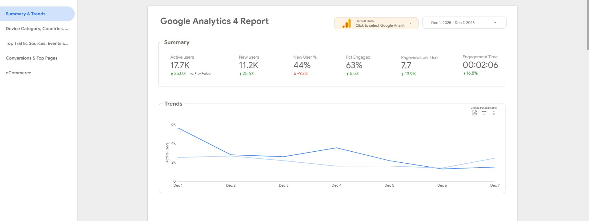
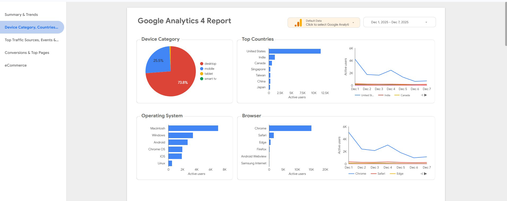
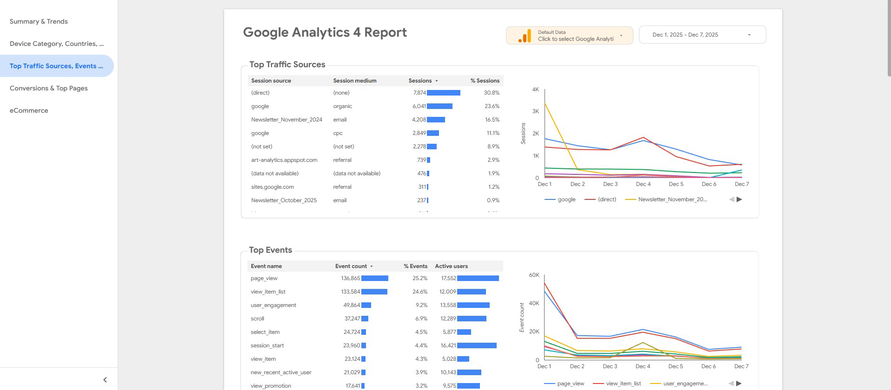

# Unified Dashboard Using Third-Party Services

This project requires collecting data from GitHub, Slack, X.com, and other sources, then storing it in an online database.
The dashboard service will access the database and display data on the website.

## Automation Script Daily Running Platform

- Google Cloud Functions

  - Limit: 2 million invocations per month free, then $0.40 per million invocations
  - Compute: 400,000 GB-seconds per month free, then $0.0000025 per GB-second
  - Supported languages: Python, Node.js, Go, Java, .NET, Ruby, PHP
  - Runtime: Up to 60 minutes per invocation

- Google Cloud Run

  - Limit: 2 million requests per month free, then $0.40 per million requests
  - Compute: 360,000 vCPU-seconds and 2 million GiB-seconds per month free, then $0.00002400 per vCPU-second and $0.00000250 per GiB-second
  - Supported languages: Any language that can run in a container
  - Runtime: Up to 60 minutes per request

**Note:** The data collection process requires approximately 700-1000 REST API calls to GitHub. Daily script execution should complete within 30 minutes since individual repository activity is limited each day.

## Online SQL Database Service

- Google Cloud SQL

  - Database type: MySQL, PostgreSQL, SQL Server
  - Storage: Pay-as-you-go pricing, approximately $0.17 per GB per month for SSD storage
  - Backups: Automatic backups with 7-day retention (configurable)
  - Free tier: $300 credit for new customers with 90 days, no always-free tier

- Neon
  - Database type: Serverless Postgres
  - Storage: 0.5 GB free, then $0.35 per GB per month
  - Backups: 1 day retention in Free Tier

**Note:** The Boost organization GitHub data from beginning to 2025-10 is approximately 240 MB in raw format.

## Online Dashboard Service

- Google Looker Studio (Recommended)

  - Cost: Free forever

- Tableau
  - Cost: 14 days free trial, then $70 per user per month

**Note:** The dashboard supports connections with view or edit permissions.

## Appendix A: Workflow

1. The automation script runs once per day on cloud service

2. Script makes REST API calls to collect data from multiple sources like GitHub, Slack, X.com etc

3. Data will be processed in the script and saved to the database

4. Dashboard service (Google Looker Studio) connects to the cloud database

5. Dashboard queries the database to retrieve stored data

6. Dashboard displays the data in visualizations (charts, graphs, tables)

## Appendix B: Development Roadmap (2 weeks)

1. Configure the online database service

2. Develop and test the data collection script locally

3. Deploy the automation script to the selected platform

4. Design and configure the dashboard

5. Connect the dashboard to the database

## Appendix C: Google Looker Studio Dashboard Template

